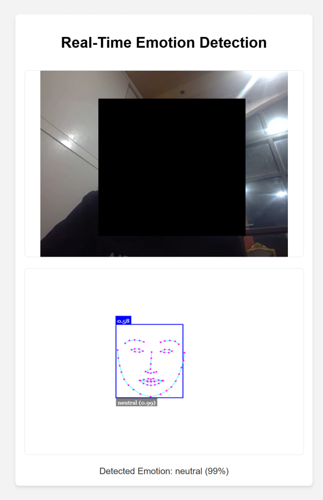

# Real-Time Emotion Detection

This is a simple web-based application that detects emotions from video feeds or images using **face-api.js**. It leverages pre-trained deep learning models to analyze facial expressions and categorize them into emotions such as **happy**, **sad**, **surprised**, **angry**, and more.



## Features

- **Real-Time Emotion Detection**: Detect emotions directly from the webcam feed.
- **Multiple Emotions**: Displays the emotion with the highest confidence score and overlays detected faces on the video feed.
- **Error Handling**: Provides a warning message if the webcam is unavailable or permission is denied.

## Technology Stack

- **HTML5**: For the webpage structure.
- **CSS3**: For styling the app.
- **JavaScript**: For handling video feed and emotion detection logic.
- **face-api.js**: A library for face detection and emotion recognition based on deep learning.

## Setup Instructions

### 1. Clone the Repository

```bash
git clone https://github.com/BaseMax/face-emotion-detection-web-live.git
cd face-emotion-detection-web-live
```

### 2. Install a Local Web Server

To run this app locally, you will need to serve the files using a local web server.

**Using http-server (via npm):**

If you have Node.js installed, you can use http-server to serve the app.

```bash
npm install -g http-server
http-server .
```

### 3. Download the Models

The app uses pre-trained models from `face-api.js`. You need to download these models and place them in a models folder in the root directory.

Go to the face-api.js model directory.

Download the following models:
- ssdMobilenetv1
- faceLandmark68Net
- faceRecognitionNet (optional)
- ageGenderNet (optional)
- faceExpressionNet

After downloading the models from the `/weights` directory (https://github.com/justadudewhohacks/face-api.js), place them in the `/models` folder within your project directory.

### 4. Run the Application

Once you have the models in place and the server running, open your browser and navigate to:

```bash
http://localhost:8080
```

You should be able to upload an image and see the emotion detected from the face.

## How It Works

- The user uploads an image using the file input.
- The image is processed using the `face-api.js` library.
- The library detects the face(s) in the image, processes the facial landmarks, and analyzes the emotion.
- The detected emotion with the highest confidence score is displayed.

## Emotion Detection

The following emotions can be detected:

- Happy
- Sad
- Surprised
- Angry
- Disgusted
- Fearful

### Contributing

If you would like to contribute to this project, feel free to fork the repository, create a branch, and submit a pull request. Make sure to follow these steps:

- Fork the repository.
- Create a new branch.
- Make your changes.
- Create a pull request.

### License

This project is licensed under the MIT License - see the LICENSE file for details.

Copyright 2024, Max Base
